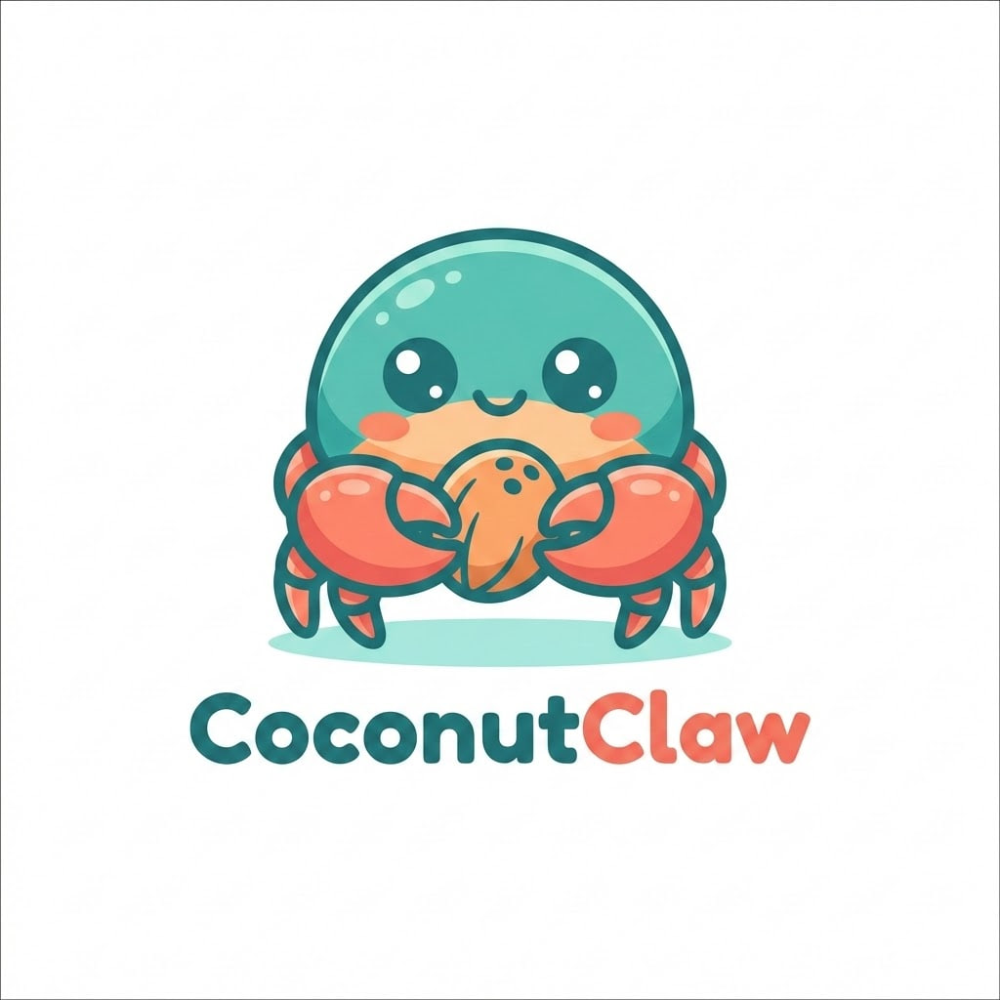
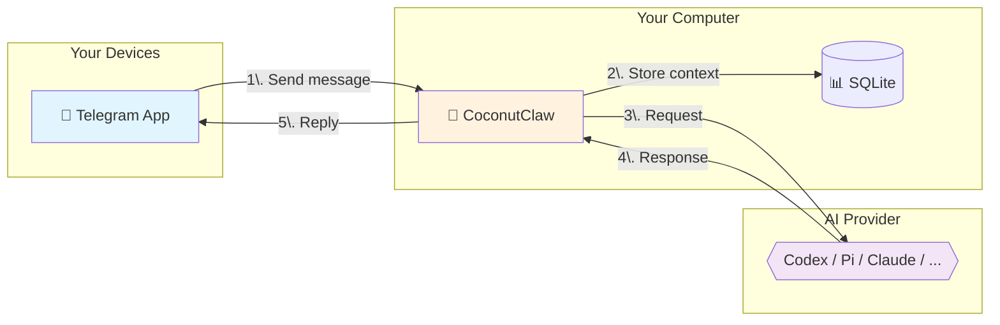

# CoconutClaw



**Your personal AI assistant on Telegram.** Send messages, get things done — no cloud subscription, no data leaving your machine.

---

## What Can It Do?

CoconutClaw helps you with everyday tasks through Telegram:

- 📝 **Answer questions** - Ask anything, get helpful responses
- 💻 **Write and fix code** - Debug, refactor, explain codebases
- 📁 **Manage files** - Organize, search, and work with local files
- 🔧 **Run commands** - Execute shell tasks safely on your machine
- 🧠 **Remember things** - Persistent memory across conversations
- 📸 **See images** - Send photos, get accurate descriptions (local vision via llama.cpp)
- 🗣️ **Voice support** - Send voice notes, get voice replies (optional)

Everything runs **locally on your computer**. Your data stays with you.

---

## Getting Started

### What You'll Need

1. **A Telegram account** - You already have this
2. **A bot token** - Free from [@BotFather](https://t.me/botfather) on Telegram
3. **Your chat ID** - Message [@userinfobot](https://t.me/userinfobot) to get it
4. **A computer** - Linux, macOS, or Windows

### Installation

#### Option A: Download Release (Recommended)

1. Download the latest release for your system from [Releases](https://github.com/lsj5031/CoconutClaw/releases)
2. Unzip the file
3. Open a terminal in the extracted folder
4. Copy the example config:
   ```bash
   cp config.toml.example config.toml
   ```
5. Edit `config.toml` and add your bot token and chat ID:
   ```toml
   TELEGRAM_BOT_TOKEN = "123456789:ABCdefGHIjklMNOpqrSTUvwxYZ"
   TELEGRAM_CHAT_ID = "123456789"
   ```
6. Install and start:
   ```bash
   ./coconutclaw service install
   ./coconutclaw service start
   ```

That's it! Message your bot on Telegram.

#### Option B: Build from Source

If you prefer building yourself:

```bash
git clone https://github.com/lsj5031/CoconutClaw.git
cd CoconutClaw
make release
cp config.toml.example config.toml
# Edit config.toml with your credentials
./target/release/coconutclaw service install
./target/release/coconutclaw service start
```

---

## Using CoconutClaw

Once running, just message your bot on Telegram:

```
You: What's in my ~/Documents folder?
Bot: I'll check that for you...
     [lists folder contents]
```

### Special Commands

Type these in Telegram:

| Command | What it does |
|---------|--------------|
| `/cancel` | Stop the current task |
| `/fresh` | Start fresh (clear conversation context) |

### Voice Messages

Send a voice note to your bot, and it can reply with voice too.

#### Recommended Tools

These tools are developed by the same author as CoconutClaw and integrate smoothly:

- **[GlmAsrDocker](https://github.com/lsj5031/GlmAsrDocker)** - Fast ASR (speech-to-text) with Docker deployment
- **[kitten-tts-rs](https://github.com/lsj5031/kitten-tts-rs)** - TTS (text-to-speech) command-line tool

#### Setup

```toml
# ASR: Use GlmAsrDocker
ASR_CMD_TEMPLATE = "glm-asr transcribe --audio {AUDIO_INPUT_PREP} --lang en"

# Or use an HTTP endpoint
ASR_URL = "http://localhost:8080/asr"

# TTS: Use kitten-tts-rs
TTS_CMD_TEMPLATE = "kitten-tts --text '{text}' --output {output}"
```

Voice is optional — text works perfectly without it.

---

## Configuration Options

Your `config.toml` can be as simple as:

```toml
TELEGRAM_BOT_TOKEN = "your-token"
TELEGRAM_CHAT_ID = "your-chat-id"
```

Optional extras:

```toml
# Choose AI provider (codex, pi, claude, opencode, gemini, or factory)
AGENT_PROVIDER = "codex"

# How much the AI thinks before responding
CODEX_REASONING_EFFORT = "xhigh"  # low, medium, high, or xhigh

# Message formatting: off | MarkdownV2 | Html
TELEGRAM_PARSE_MODE = "MarkdownV2"
TELEGRAM_PARSE_FALLBACK = "plain"
```

---

## AI Providers

CoconutClaw supports multiple AI backends. Configure your preference in `config.toml`:

| Provider | `AGENT_PROVIDER` | Description |
|----------|-----------------|-------------|
| **Codex** | `codex` | Powered by the `codex` CLI tool. Excellent for advanced coding and automation. |
| **Pi** | `pi` | Powered by the `pi-rust` CLI. Great for general purpose and reasoning. Supports vision via `@file` attachments. |
| **Claude** | `claude` | Integration with `claude` code CLI. |
| **OpenCode** | `opencode` | Support for OpenCode CLI tools. |
| **Gemini** | `gemini` | Integration with Gemini CLI. |
| **Factory** | `factory` | Powered by Factory.ai's `droid` CLI. |

Each provider has its own configuration block in `config.toml` to specify the binary path, model, and reasoning effort.

### Local Vision Stack (Fully Offline)

CoconutClaw can run a **completely local multi-modal pipeline** — no cloud, no API costs. Send a photo on Telegram and get an accurate description powered by your own GPU.

#### What You Need

- An NVIDIA GPU (tested on RTX 3070 8GB)
- Docker with NVIDIA Container Toolkit
- A GGUF vision model (e.g., Qwen3.5-4B-Q8_0)
- `pi-rust` CLI as the agent runner (configured as `PI_BIN`)

#### How It Works

```
Telegram Photo → CoconutClaw → pi-rust (@image.jpg) → llama-server → Qwen3.5 Vision
                                  ↓                        ↓
                            OpenAI Chat API          ChatML + mmproj
                            (base64 image_url)       (native vision tokens)
```

1. CoconutClaw downloads the photo from Telegram
2. Passes it to `pi-rust` via the `@path` convention
3. `pi-rust` base64-encodes the image into an OpenAI-compatible `image_url` content block
4. `llama-server` processes it through the multimodal projection model (`mmproj`) alongside the text prompt
5. The model sees actual pixels and responds accurately

#### Setup

**1. Start llama-server with Docker:**

```yaml
# docker-compose.yml
services:
  qwen3.5-server:
    image: ghcr.io/ggml-org/llama.cpp:server-cuda
    entrypoint: /app/llama-server
    command:
      - -m
      - /models/Qwen3.5-4B-Q8_0.gguf
      - --mmproj
      - /models/qwen3.5-mmproj-f16.gguf
      - --host
      - 0.0.0.0
      - --port
      - "8080"
      - --ctx-size
      - "65536"
      - --n-gpu-layers
      - "99"
      - --chat-template
      - "{{'<|im_start|>' + message['role'] + '\\n' + message['content'] + '<|im_end|>' + '\\n'}}{{ '<|im_start|>assistant\\n' }}"
      - --reasoning-format
      - none
      - --jinja
      - --parallel
      - "4"
    volumes:
      - ./:/models
    ports:
      - "11234:8080"
    deploy:
      resources:
        reservations:
          devices:
            - driver: nvidia
              count: 1
              capabilities: [gpu]
```

**2. Configure the provider in `models.json`:**

```json
{
  "providers": {
    "qwen3.5-local": {
      "baseUrl": "http://localhost:11234/v1",
      "apiKey": "dummy",
      "api": "openai-completions",
      "models": [{
        "id": "Qwen3.5-4B-Q8_0.gguf",
        "name": "Qwen 3.5 4B (Local)",
        "reasoning": false,
        "input": ["text", "image"],
        "contextWindow": 32768,
        "maxTokens": 32768
      }]
    }
  }
}
```

**3. Configure the instance:**

```toml
AGENT_PROVIDER = "pi"
PI_BIN = "pi-rust"
PI_MODEL = "qwen3.5-local/Qwen3.5-4B-Q8_0.gguf"
PI_NO_EXTENSIONS = "on"  # Disables tools/extensions for llama.cpp compatibility
```

#### Lessons Learned

| Problem | Symptom | Fix |
|---------|---------|-----|
| **Wrong API format** | Model hallucinates image content (never sees pixels) | Set `"api": "openai-completions"` — not `"anthropic-messages"`. llama-server only speaks OpenAI format. |
| **Missing `/v1` path** | Connection errors or silent failures | Use `"baseUrl": "http://localhost:11234/v1"` — the OpenAI-compatible endpoint requires the `/v1` prefix. |
| **Generic chat template** | Model ignores visual data | Hardcode the ChatML Jinja template via `--chat-template`. Auto-detection may fall back to "Generic". |
| **"Use your tools" prompt** | Model tries to `cat` the image file | Tell the model the image is embedded in its input — don't mention file paths or tools. |
| **`<think>` tag noise** | Empty reasoning blocks in output | Add `/no_think` to SOUL.md; strip `<think>...</think>` in output parsing. |
| **JSON streaming mismatch** | Raw JSON dumped as Telegram reply | `pi-rust --mode json` uses a different event format than legacy `pi`. Update `extract_pi_json_final` to parse `turn_end`/`agent_end` events. |
| **Binary context explosions** | 22k+ token context, server hangs | Prevent agents from reading image files as text. Pass images via native `@path` vision pipeline only. |
| **Slot deadlocks** | Server hangs with `--parallel 1` | Use `--parallel 4` so the main agent and tool calls don't compete for the same slot. |

---

## Running Multiple Assistants

Want separate assistants for work and personal use?

```bash
# Create a "work" instance
./coconutclaw --instance work service install
./coconutclaw --instance work service start

# Or use a custom location
./coconutclaw --instance-dir ~/my-assistants/personal service install
```

Each instance keeps its own:
- Conversation history
- Memory and notes
- Configuration
- Logs

---

## Controlling the Service

| Action | Command |
|--------|---------|
| Install as background service | `./coconutclaw service install` |
| Start | `./coconutclaw service start` |
| Check status | `./coconutclaw service status` |
| Stop | `./coconutclaw service stop` |
| Remove service | `./coconutclaw service uninstall` |
| Run once manually | `./coconutclaw run` |
| Health check | `./coconutclaw doctor` |

---

## Scheduled Tasks

CoconutClaw can run tasks automatically:

- **Heartbeat** (default: 9:00 AM) - Health check
- **Nightly reflection** (default: 10:30 PM) - Daily summary

Customize when installing:

```bash
./coconutclaw service install --heartbeat 10:00 --reflection 23:00
```

---

## How It Works



### Message Flow

1. **You message** your bot on Telegram
2. **CoconutClaw** receives it via webhook/polling on your machine
3. **Context** is loaded from local SQLite (memory, conversation history)
4. **AI provider** processes your request (e.g., Codex, Pi, or Claude)
5. **Response** is sent back to Telegram

All processing happens on *your* computer. The AI provider sees only the message content — your files, memory, and history stay local.

---

## Privacy & Security

- 🔒 **Self-hosted** - Runs on your hardware
- 💾 **Local storage** - Conversation history in local SQLite
- 🚫 **No tracking** - No telemetry, no analytics
- 🔑 **Your API keys** - If using cloud AI, you control the keys

---

## For Developers

### Project Structure

```
CoconutClaw/
├── crates/
│   ├── coconutclaw-cli/      # CLI and main agent loop
│   ├── coconutclaw-config/   # Configuration handling
│   └── coconutclaw-provider/ # AI provider abstraction
├── scripts/                  # Optional ASR/TTS helpers
└── sql/                      # Database migrations
```

~5,500 lines of Rust, 58 tests.

### Development Commands

```bash
make dev        # Debug build
make release    # Optimized build
make test       # Run tests
make lint       # Clippy checks
make hooks      # Install git pre-commit hook
```

---

## License

MIT — use it however you'd like.

---

## Credits

Built with Rust, axum, reqwest, rusqlite, and telegram-markdown-v2.
