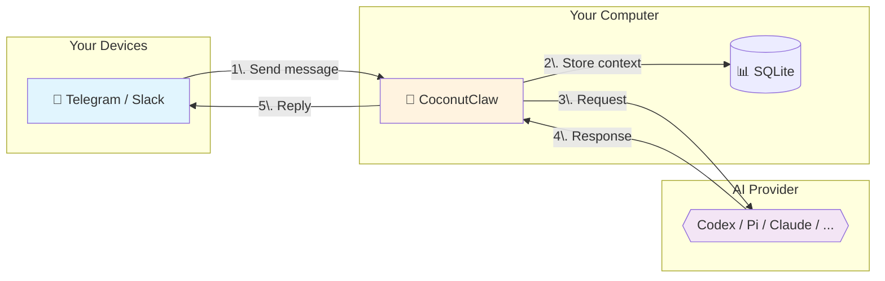

# CoconutClaw


**Your personal AI assistant on Telegram and Slack.** Send messages, get things done — no cloud subscription, state and orchestration stay local.

---

## 🌟 What Can It Do?

CoconutClaw transforms your computer into a powerful AI agent accessible via Telegram and Slack:

- 📝 **Answer questions** - Ask anything, get helpful responses.
- 💻 **Write and fix code** - Debug, refactor, and explain local codebases.
- 📁 **Manage files** - Organize, search, and work with your local filesystem.
- 🔧 **Run commands** - Execute shell tasks safely on your machine.
- 🧠 **Persistent Memory** - Remembers your preferences and past conversations across sessions.
- 💬 **Multi-Transport** — Use Telegram, Slack, or both. Each chat/channel is an independent session.
- 📸 **Local Vision** - Send photos and get descriptions using local models (no cloud APIs).
- 🗣️ **Voice Interface** - Send voice notes and receive voice replies (optional).

**State and orchestration run locally on your computer.** External transports (Telegram, Slack) and AI providers (Codex, Claude, etc.) may receive content depending on your configuration. Configure at least one transport — Telegram, Slack, or both — to start using CoconutClaw.

---

## 🚀 Getting Started

### Prerequisites

1. **A Telegram account or Slack workspace**
2. **A Bot Token** — Get one for free from [@BotFather](https://t.me/botfather) (Telegram) or [api.slack.com/apps](https://api.slack.com/apps) (Slack)
3. **Your Chat ID** — Get yours from [@userinfobot](https://t.me/userinfobot) (Telegram) or channel details (Slack)
4. **A Computer** — Linux, macOS, or Windows

> **Telegram or Slack?** You need at least one transport configured. For Slack-only, skip the Telegram config and follow the [Slack Setup](#-slack-setup) section below.

### Installation

#### Option A: Download Release (Recommended)

1. Download the latest release for your system from [Releases](https://github.com/lsj5031/CoconutClaw/releases)
2. Unzip the archive to a folder of your choice.
3. Open a terminal in that folder.
4. Copy the example configuration:
   ```bash
   cp config.toml.example config.toml
   ```
5. Edit `config.toml` with your credentials:
   ```toml
   TELEGRAM_BOT_TOKEN = "123456:ABC-def..."
   TELEGRAM_CHAT_ID = "123456789"

   # Or configure Slack instead — see Slack Setup section below.
   ```
6. Install and start the background service:
   ```bash
   ./coconutclaw service install
   ./coconutclaw service start
   ```

#### Option B: Build from Source

```bash
git clone https://github.com/lsj5031/CoconutClaw.git
cd CoconutClaw
make release
cp config.toml.example config.toml
# Edit config.toml with your credentials
./target/release/coconutclaw service install
./target/release/coconutclaw service start
```

---

## 💬 Slack Setup

CoconutClaw supports two Slack integration modes:

- **Socket Mode** — Simple, no public URL needed. CoconutClaw connects directly to Slack via WebSocket. Best for local/home setups.
- **Webhook Mode** — Slack sends events to CoconutClaw via HTTP. Requires a public URL or reverse proxy. Best for production/server deployments.

You only need **one** mode. Pick whichever fits your setup.

### Prerequisites for Both Modes

1. Go to [api.slack.com/apps](https://api.slack.com/apps) and click **Create New App** → **From scratch**.
2. Name it (e.g., "CoconutClaw") and pick your workspace.

### A) Socket Mode Setup

#### 1. Enable Socket Mode

In your app's settings:

- Go to **Socket Mode** → toggle **Enable Socket Mode**.
- Give it a token name (e.g., "coconutclaw-socket") and copy the **App-Level Token** (starts with `xapp-`).
  - This goes in `config.toml` as `SLACK_APP_TOKEN`.
- Give the App-Level Token the **`connections:write`** scope — this is what allows CoconutClaw to open the Socket Mode WebSocket. (Slack requires `connections:write` on the App-Level Token, *not* on the Bot Token.)

#### 2. Configure Bot Token Scopes

Go to **OAuth & Permissions** → **Bot Token Scopes** and add:

| Scope | Purpose |
|:---|:---|
| `chat:write` | Send and update messages |
| `files:read` | Download files shared by users |
| `files:write` | Upload files (photos, documents, voice) |
| `channels:history` | Read channel message history |
| `channels:read` | Access channel info |
| `groups:history` | Read private channel history |
| `groups:read` | Access private channel info |
| `im:history` | Read DM history |
| `im:read` | Access DM info |
| `mpim:history` | Read group DM history |
| `mpim:read` | Access group DM info |
Then click **Install to Workspace** and copy the **Bot User OAuth Token** (starts with `xoxb-`).

#### 3. Create Slash Commands

Go to **Slash Commands** and create the following:

| Command | Description |
|:---|:---|
| `/cancel` | Stop the current task |
| `/fresh` | Clear conversation context |
| `/tasks` | List active tasks |
| `/schedules` | List scheduled tasks |

For each command, you can leave the **Request URL** blank — Socket Mode handles routing automatically.

To use the Approve/Reject buttons, go to **Interactivity & Shortcuts** → toggle **Enable**. Socket Mode handles this automatically; no Request URL is needed.

#### 4. Get Your Channel ID

In Slack, right-click the channel you want CoconutClaw to monitor → **View channel details**. Copy the **Channel ID** (starts with `C`).

#### 5. Configure CoconutClaw

Add to your `config.toml`:

```toml
# Socket Mode — no webhook or public URL needed
SLACK_BOT_TOKEN = "xoxb-..."
SLACK_APP_TOKEN = "xapp-..."
SLACK_CHANNEL_ID = "C01234567"

# Optional: User token for fetching thread context (starts with xoxp-)
# Get this from OAuth & Permissions → User Token Scopes
# Requires: channels:history, groups:history, im:history, mpim:history
# SLACK_USER_TOKEN = "xoxp-..."

# Optional: Restrict admin commands to specific user IDs
# SLACK_ADMIN_USER_IDS = "U123,U456"

# Optional: Formatting mode
# plain | mrkdwn | blocks (default: mrkdwn)
# SLACK_FORMAT_MODE = "mrkdwn"
```

**That's it!** Restart CoconutClaw and it will connect to Slack automatically:

```bash
./coconutclaw service stop && ./coconutclaw service start
```

If SLACK_BOT_TOKEN + SLACK_APP_TOKEN are present, Socket Mode starts automatically — no extra flags needed.

### B) Webhook Mode Setup

Webhook Mode is useful when running CoconutClaw on a server with a public URL.

#### 1. Enable Events API

In your app's settings:

- Go to **Event Subscriptions** → toggle **Enable Events**.
- Set the **Request URL** to `https://your-server.com/slack/events` (replace with your actual server URL).
- Slack will send a verification challenge — CoconutClaw handles this automatically.

#### 2. Subscribe to Bot Events

Under **Subscribe to bot events**, add:

| Event | Purpose |
|:---|:---|
| `message.channels` | Receive public channel messages |
| `message.groups` | Receive private channel messages |
| `message.im` | Receive direct messages |
| `message.mpim` | Receive group DM messages |

#### 3. Configure Bot Token Scopes

Same scopes as Socket Mode above. Add the scopes, install to workspace, and copy the **Bot User OAuth Token** (`xoxb-...`).

#### 4. Get Your Signing Secret

Go to **Basic Information** → **App Credentials** → copy the **Signing Secret**.

#### 5. Set Up Slash Commands and Interactivity

Go to **Slash Commands** and create these commands:

| Command | Description |
|:---|:---|
| `/cancel` | Stop the current task |
| `/fresh` | Clear conversation context |
| `/tasks` | List active tasks |
| `/schedules` | List scheduled tasks |

For each command, set the **Request URL** to `https://your-server.com/slack/events`.

Then go to **Interactivity & Shortcuts** → toggle **Enable**. Set the **Request URL** to the same `https://your-server.com/slack/events` — this is required for Approve/Reject buttons to work.

#### 6. Get Your Channel ID

Same as Socket Mode — right-click the channel → **View channel details** → copy the Channel ID.

#### 7. Configure CoconutClaw

```toml
# Enable webhook mode
WEBHOOK_MODE = "on"
WEBHOOK_BIND = "127.0.0.1:8787"
WEBHOOK_PUBLIC_URL = "https://your-server.com"
WEBHOOK_PATH = "/webhook"

# Slack webhook
SLACK_BOT_TOKEN = "xoxb-..."
SLACK_SIGNING_SECRET = "..."
SLACK_CHANNEL_ID = "C01234567"

# Optional: same extras as Socket Mode
# SLACK_USER_TOKEN = "xoxp-..."
# SLACK_ADMIN_USER_IDS = "U123,U456"
# SLACK_FORMAT_MODE = "mrkdwn"
```

If you're behind a reverse proxy (nginx, Caddy), point it at `WEBHOOK_BIND` and set `WEBHOOK_PUBLIC_URL` to your domain.

### Interactive Features (Both Modes)

Once connected, CoconutClaw supports:

- **Slash Commands** — Type `/cancel`, `/fresh`, `/tasks`, `/schedules` directly in Slack.
- **Approval Buttons** — When a task requires approval, you'll see Approve / Reject buttons (Block Kit interactive).
- **Thread Replies** — CoconutClaw replies in threads when you message in a thread.
- **File Attachments** — Send photos, documents, or videos; CoconutClaw can download and process them.
- **Voice Replies** — If TTS is configured, voice replies are uploaded as audio files.

### Troubleshooting

| Problem | Check |
|:---|:---|
| Bot doesn't respond | Verify `SLACK_BOT_TOKEN` starts with `xoxb-` and `SLACK_CHANNEL_ID` is uppercase alphanumeric |
| Socket Mode fails to connect | Ensure `SLACK_APP_TOKEN` starts with `xapp-` and Socket Mode is enabled in the app |
| Webhook signature verification fails | Confirm `SLACK_SIGNING_SECRET` matches the value in Basic Information |
| "not_in_channel" error | Invite the bot to the channel (`/invite @CoconutClaw`) |
| Admin commands ignored | Check `SLACK_ADMIN_USER_IDS` includes your user ID |

---

## 🛠️ Using CoconutClaw

Once the service is running, simply message your bot on Telegram, or send a message in your configured Slack channel.

**Example:**
> **You:** What's in my ~/Documents folder?
> **Bot:** I'll check that for you... [lists folder contents]

### Special Commands
Type these directly in Telegram or Slack:
- `/cancel` — Stop the current task immediately.
- `/fresh` — Clear the current conversation context for a fresh start.
- `/schedules` — List configured scheduled tasks.
- `/tasks` — List active tasks in the current session.

### Voice & ASR Setup (Optional)
To enable voice messages, configure these templates in `config.toml`:

```toml
# ASR: Speech-to-Text (Example using GlmAsrDocker)
ASR_CMD_TEMPLATE = "glm-asr transcribe --audio {AUDIO_INPUT_PREP} --lang en"
# Or use an HTTP endpoint:
# ASR_URL = "http://localhost:8080/asr"

# TTS: Text-to-Speech (Example using kitten-tts-rs)
TTS_CMD_TEMPLATE = "kitten-tts --text '{text}' --output {output}"
```
*Recommended tools: [GlmAsrDocker](https://github.com/lsj5031/GlmAsrDocker) and [kitten-tts-rs](https://github.com/lsj5031/kitten-tts-rs).*

---

## ⚙️ Configuration

Your `config.toml` manages how the agent behaves.

### Basic Setup
```toml
TELEGRAM_BOT_TOKEN = "your_token"
TELEGRAM_CHAT_ID = "your_chat_id"
```

### Advanced Options
```toml
# AI Provider: codex, pi, claude, opencode, antigravity, or factory
AGENT_PROVIDER = "codex"

# Telegram formatting: off | MarkdownV2 | Html
TELEGRAM_PARSE_MODE = "MarkdownV2"
TELEGRAM_PARSE_FALLBACK = "plain"
```

### Supported AI Providers

| Provider | `AGENT_PROVIDER` | Best For... |
| :--- | :--- | :--- |
| **Codex** | `codex` | Advanced coding and complex system automation. |
| **Pi** | `pi` | General reasoning and multimodal (vision) tasks. |
| **Claude** | `claude` | Integration with Claude Code CLI. |
| **OpenCode** | `opencode` | Support for OpenCode CLI tools. |
| **Antigravity** | `antigravity` | Integration with the Antigravity CLI. |
| **Factory** | `factory` | Powered by Factory.ai's `droid` CLI. |

---

## ⚙️ How It Works



1. **You message** your bot on Telegram or in your Slack channel.
2. **CoconutClaw** receives it on your machine.
3. **Context** (memory, history) is loaded from the local SQLite database.
4. **AI provider** processes the request.
5. **Response** is sent back to you via your chat app.

---

## 👁️ Local Vision Stack (Fully Offline)

Run a completely local multi-modal pipeline with no cloud API costs.

### Requirements
- NVIDIA GPU (RTX 3070 8GB+ tested)
- Docker with NVIDIA Container Toolkit
- GGUF Vision Model (e.g., Qwen3.5-4B)
- `pi-rust` CLI configured as the agent runner.

### Quick Setup
1. **Start llama-server** via Docker (example: `docker run -p 11234:11234 -v /path/to/models:/models ghcr.io/ggml-org/llama.cpp:server -m /models/your-model.gguf`).
2. **Configure provider** to point to `http://localhost:11234/v1`.
3. **Set instance config**:
   ```toml
   AGENT_PROVIDER = "pi"
   PI_BIN = "pi-rust"
   PI_MODEL = "qwen3.5-local/Qwen3.5-4B-Q8_0.gguf"
   PI_NO_EXTENSIONS = "on" # Required for llama.cpp compatibility
   ```

---

## 👥 Multiple Assistants

You can run separate instances for different roles (e.g., "Work" vs "Personal"):

```bash
# Create and start a "work" instance
./coconutclaw --instance work service install
./coconutclaw --instance work service start
```
Each instance maintains its own isolated conversation history, memory, and logs.

---

## 🖥️ Management Commands

| Action | Command |
| :--- | :--- |
| **Install Service** | `./coconutclaw service install` |
| **Start Service** | `./coconutclaw service start` |
| **Stop Service** | `./coconutclaw service stop` |
| **Check Status** | `./coconutclaw service status` |
| **Uninstall** | `./coconutclaw service uninstall` |
| **Manual Run** | `./coconutclaw run` |
| **One-Shot Test** | `./coconutclaw once --inject-text "hello"` |
| **System Check** | `./coconutclaw doctor` |

**Scheduled Tasks:**
Customize system heartbeats and nightly reflections during installation:
```bash
./coconutclaw service install --heartbeat 10:00 --reflection 23:00
```

---

## 🏗️ For Developers

### Project Layout
- `crates/coconutclaw-cli` — Main runtime loop, Telegram/Slack I/O, and session scheduler.
- `crates/coconutclaw-config` — Configuration and instance management.
- `crates/coconutclaw-provider` — AI provider abstraction layer.
- `sql/schema.sql` — SQLite schema for history and memory.

### Build Commands
```bash
make dev        # Debug build
make release    # Optimized release build
make test       # Run test suite
make lint       # Clippy checks
make hooks      # Install pre-commit hooks
```

---

## ⚖️ License
MIT — Use it however you'd like.
