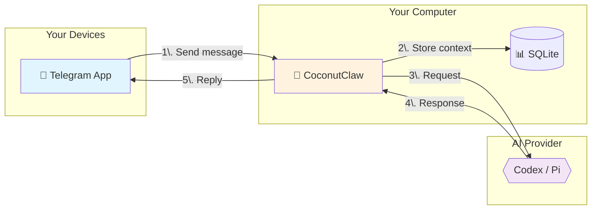

# CoconutClaw


**Your personal AI assistant on Telegram.** Send messages, get things done — no cloud subscription, no data leaving your machine.

---

## What Can It Do?

CoconutClaw helps you with everyday tasks through Telegram:

- 📝 **Answer questions** - Ask anything, get helpful responses
- 💻 **Write and fix code** - Debug, refactor, explain codebases
- 📁 **Manage files** - Organize, search, and work with local files
- 🔧 **Run commands** - Execute shell tasks safely on your machine
- 🧠 **Remember things** - Persistent memory across conversations
- 🗣️ **Voice support** - Send voice notes, get voice replies (optional)

Everything runs **locally on your computer**. Your data stays with you.

---

## Getting Started

### What You'll Need

1. **A Telegram account** - You already have this
2. **A bot token** - Free from [@BotFather](https://t.me/botfather) on Telegram
3. **Your chat ID** - Message [@userinfobot](https://t.me/userinfobot) to get it
4. **A computer** - Linux, macOS, or Windows

### Installation

#### Option A: Download Release (Recommended)

1. Download the latest release for your system from [Releases](https://github.com/lsj5031/CoconutClaw/releases)
2. Unzip the file
3. Open a terminal in the extracted folder
4. Copy the example config:
   ```bash
   cp config.toml.example config.toml
   ```
5. Edit `config.toml` and add your bot token and chat ID:
   ```toml
   TELEGRAM_BOT_TOKEN = "123456789:ABCdefGHIjklMNOpqrSTUvwxYZ"
   TELEGRAM_CHAT_ID = "123456789"
   ```
6. Install and start:
   ```bash
   ./coconutclaw service install
   ./coconutclaw service start
   ```

That's it! Message your bot on Telegram.

#### Option B: Build from Source

If you prefer building yourself:

```bash
git clone https://github.com/lsj5031/CoconutClaw.git
cd CoconutClaw
make release
cp config.toml.example config.toml
# Edit config.toml with your credentials
./target/release/coconutclaw service install
./target/release/coconutclaw service start
```

---

## Using CoconutClaw

Once running, just message your bot on Telegram:

```
You: What's in my ~/Documents folder?
Bot: I'll check that for you...
     [lists folder contents]
```

### Special Commands

Type these in Telegram:

| Command | What it does |
|---------|--------------|
| `/cancel` | Stop the current task |
| `/fresh` | Start fresh (clear conversation context) |

### Voice Messages

Send a voice note to your bot, and it can reply with voice too.

#### Recommended Tools

These tools are developed by the same author as CoconutClaw and integrate smoothly:

- **[glm-asr](https://github.com/lsj5031/glm-asr)** - Fast ASR (speech-to-text) with Docker deployment
- **tts-cli** - TTS (text-to-speech) command-line tool

#### Setup

```toml
# ASR: Use glm-asr
ASR_CMD_TEMPLATE = "glm-asr transcribe --audio {AUDIO_INPUT_PREP} --lang en"

# Or use an HTTP endpoint
ASR_URL = "http://localhost:8080/asr"

# TTS: Use tts-cli
TTS_CMD_TEMPLATE = "tts-cli --text '{text}' --output {output}"
```

Voice is optional — text works perfectly without it.

---

## Configuration Options

Your `config.toml` can be as simple as:

```toml
TELEGRAM_BOT_TOKEN = "your-token"
TELEGRAM_CHAT_ID = "your-chat-id"
```

Optional extras:

```toml
# Choose AI provider (codex or pi)
AGENT_PROVIDER = "codex"

# How much the AI thinks before responding
CODEX_REASONING_EFFORT = "xhigh"  # low, medium, high, or xhigh

# Message formatting
TELEGRAM_PARSE_MODE = "MarkdownV2"
TELEGRAM_PARSE_FALLBACK = "plain"
```

---

## Running Multiple Assistants

Want separate assistants for work and personal use?

```bash
# Create a "work" instance
./coconutclaw --instance work service install
./coconutclaw --instance work service start

# Or use a custom location
./coconutclaw --instance-dir ~/my-assistants/personal service install
```

Each instance keeps its own:
- Conversation history
- Memory and notes
- Configuration
- Logs

---

## Controlling the Service

| Action | Command |
|--------|---------|
| Install as background service | `./coconutclaw service install` |
| Start | `./coconutclaw service start` |
| Check status | `./coconutclaw service status` |
| Stop | `./coconutclaw service stop` |
| Remove service | `./coconutclaw service uninstall` |
| Run once manually | `./coconutclaw run` |
| Health check | `./coconutclaw doctor` |

---

## Scheduled Tasks

CoconutClaw can run tasks automatically:

- **Heartbeat** (default: 9:00 AM) - Health check
- **Nightly reflection** (default: 10:30 PM) - Daily summary

Customize when installing:

```bash
./coconutclaw service install --heartbeat 10:00 --reflection 23:00
```

---

## How It Works



### Message Flow

1. **You message** your bot on Telegram
2. **CoconutClaw** receives it via webhook/polling on your machine
3. **Context** is loaded from local SQLite (memory, conversation history)
4. **AI provider** processes your request (Codex or Pi)
5. **Response** is sent back to Telegram

All processing happens on *your* computer. The AI provider sees only the message content — your files, memory, and history stay local.

---

## Privacy & Security

- 🔒 **Self-hosted** - Runs on your hardware
- 💾 **Local storage** - Conversation history in local SQLite
- 🚫 **No tracking** - No telemetry, no analytics
- 🔑 **Your API keys** - If using cloud AI, you control the keys

---

## For Developers

### Project Structure

```
CoconutClaw/
├── crates/
│   ├── coconutclaw-cli/      # CLI and main agent loop
│   ├── coconutclaw-config/   # Configuration handling
│   └── coconutclaw-provider/ # AI provider abstraction
├── scripts/                  # Optional ASR/TTS helpers
└── sql/                      # Database migrations
```

~5,500 lines of Rust, 58 tests.

### Development Commands

```bash
make dev        # Debug build
make release    # Optimized build
make test       # Run tests
make lint       # Clippy checks
```

---

## License

MIT — use it however you'd like.

---

## Credits

Built with Rust, axum, reqwest, rusqlite, and telegram-markdown-v2.
