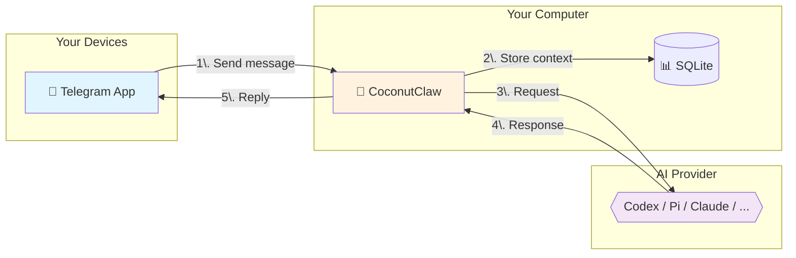

# CoconutClaw


**Your personal AI assistant on Telegram.** Send messages, get things done — no cloud subscription, no data leaving your machine.

---

## 🌟 What Can It Do?

CoconutClaw transforms your computer into a powerful AI agent accessible via Telegram:

- 📝 **Answer questions** - Ask anything, get helpful responses.
- 💻 **Write and fix code** - Debug, refactor, and explain local codebases.
- 📁 **Manage files** - Organize, search, and work with your local filesystem.
- 🔧 **Run commands** - Execute shell tasks safely on your machine.
- 🧠 **Persistent Memory** - Remembers your preferences and past conversations across sessions.
- 📸 **Local Vision** - Send photos and get descriptions using local models (no cloud APIs).
- 🗣️ **Voice Interface** - Send voice notes and receive voice replies (optional).

**Everything runs locally on your computer.** Your data stays with you.

---

## 🚀 Getting Started

### Prerequisites

1. **A Telegram account**
2. **A Bot Token** - Get one for free from [@BotFather](https://t.me/botfather)
3. **Your Chat ID** - Get yours from [@userinfobot](https://t.me/userinfobot)
4. **A Computer** - Linux, macOS, or Windows

### Installation

#### Option A: Download Release (Recommended)

1. Download the latest release for your system from [Releases](https://github.com/lsj5031/CoconutClaw/releases)
2. Unzip the archive to a folder of your choice.
3. Open a terminal in that folder.
4. Copy the example configuration:
   ```bash
   cp config.toml.example config.toml
   ```
5. Edit `config.toml` with your credentials:
   ```toml
   TELEGRAM_BOT_TOKEN = "123456:ABC-def..."
   TELEGRAM_CHAT_ID = "123456789"
   ```
6. Install and start the background service:
   ```bash
   ./coconutclaw service install
   ./coconutclaw service start
   ```

#### Option B: Build from Source

```bash
git clone https://github.com/lsj5031/CoconutClaw.git
cd CoconutClaw
make release
cp config.toml.example config.toml
# Edit config.toml with your credentials
./target/release/coconutclaw service install
./target/release/coconutclaw service start
```

---

## 🛠️ Using CoconutClaw

Once the service is running, simply message your bot on Telegram.

**Example:**
> **You:** What's in my ~/Documents folder?
> **Bot:** I'll check that for you... [lists folder contents]

### Special Commands
Type these directly in Telegram:
- `/cancel` — Stop the current task immediately.
- `/fresh` — Clear the current conversation context for a fresh start.

### Voice & ASR Setup (Optional)
To enable voice messages, configure these templates in `config.toml`:

```toml
# ASR: Speech-to-Text (Example using GlmAsrDocker)
ASR_CMD_TEMPLATE = "glm-asr transcribe --audio {AUDIO_INPUT_PREP} --lang en"
# Or use an HTTP endpoint:
# ASR_URL = "http://localhost:8080/asr"

# TTS: Text-to-Speech (Example using kitten-tts-rs)
TTS_CMD_TEMPLATE = "kitten-tts --text '{text}' --output {output}"
```
*Recommended tools: [GlmAsrDocker](https://github.com/lsj5031/GlmAsrDocker) and [kitten-tts-rs](https://github.com/lsj5031/kitten-tts-rs).*

---

## ⚙️ Configuration

Your `config.toml` manages how the agent behaves.

### Basic Setup
```toml
TELEGRAM_BOT_TOKEN = "your_token"
TELEGRAM_CHAT_ID = "your_chat_id"
```

### Advanced Options
```toml
# AI Provider: codex, pi, claude, opencode, gemini, or factory
AGENT_PROVIDER = "codex"

# Reasoning effort for Codex: low, medium, high, or xhigh
CODEX_REASONING_EFFORT = "xhigh"

# Telegram formatting: off | MarkdownV2 | Html
TELEGRAM_PARSE_MODE = "MarkdownV2"
TELEGRAM_PARSE_FALLBACK = "plain"
```

### Supported AI Providers

| Provider | `AGENT_PROVIDER` | Best For... |
| :--- | :--- | :--- |
| **Codex** | `codex` | Advanced coding and complex system automation. |
| **Pi** | `pi` | General reasoning and multimodal (vision) tasks. |
| **Claude** | `claude` | Integration with Claude Code CLI. |
| **OpenCode** | `opencode` | Support for OpenCode CLI tools. |
| **Gemini** | `gemini` | Integration with Gemini CLI. |
| **Factory** | `factory` | Powered by Factory.ai's `droid` CLI. |

---

## ⚙️ How It Works



1. **You message** your bot on Telegram.
2. **CoconutClaw** receives it on your machine.
3. **Context** (memory, history) is loaded from the local SQLite database.
4. **AI provider** processes the request.
5. **Response** is sent back to you via Telegram.

---

## 👁️ Local Vision Stack (Fully Offline)

Run a completely local multi-modal pipeline with no cloud API costs.

### Requirements
- NVIDIA GPU (RTX 3070 8GB+ tested)
- Docker with NVIDIA Container Toolkit
- GGUF Vision Model (e.g., Qwen3.5-4B)
- `pi-rust` CLI configured as the agent runner.

### Quick Setup
1. **Start llama-server** via Docker (see `docker-compose.yml` example in the repo).
2. **Configure provider** in `models.json` to point to `http://localhost:11234/v1` with `api: \"openai-completions\"`.
3. **Set instance config**:
   ```toml
   AGENT_PROVIDER = "pi"
   PI_BIN = "pi-rust"
   PI_MODEL = "qwen3.5-local/Qwen3.5-4B-Q8_0.gguf"
   PI_NO_EXTENSIONS = "on" # Required for llama.cpp compatibility
   ```

---

## 👥 Multiple Assistants

You can run separate instances for different roles (e.g., "Work" vs "Personal"):

```bash
# Create and start a "work" instance
./coconutclaw --instance work service install
./coconutclaw --instance work service start
```
Each instance maintains its own isolated conversation history, memory, and logs.

---

## 🖥️ Management Commands

| Action | Command |
| :--- | :--- |
| **Install Service** | `./coconutclaw service install` |
| **Start Service** | `./coconutclaw service start` |
| **Stop Service** | `./coconutclaw service stop` |
| **Check Status** | `./coconutclaw service status` |
| **Uninstall** | `./coconutclaw service uninstall` |
| **Manual Run** | `./coconutclaw run` |
| **System Check** | `./coconutclaw doctor` |

**Scheduled Tasks:**
Customize system heartbeats and nightly reflections during installation:
```bash
./coconutclaw service install --heartbeat 10:00 --reflection 23:00
```

---

## 🏗️ For Developers

### Project Layout
- `crates/coconutclaw-cli` — Main runtime loop and Telegram I/O.
- `crates/coconutclaw-config` — Configuration and instance management.
- `crates/coconutclaw-provider` — AI provider abstraction layer.
- `sql/schema.sql` — SQLite schema for history and memory.

### Build Commands
```bash
make dev        # Debug build
make release    # Optimized release build
make test       # Run test suite
make lint       # Clippy checks
make hooks      # Install pre-commit hooks
```

---

## ⚖️ License
MIT — Use it however you'd like.
